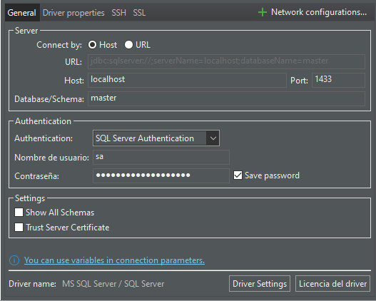

# Descripcion de implementacion de SqlServer en Docker

- [docker hub, imagen de SQL server](https://hub.docker.com/_/microsoft-mssql-server)

## Comandos implementados (uso de consola)

### Correr imagen

Descargar imagen

```bash
    docker pull mcr.microsoft.com/mssql/server
```

Ejecucion de imagen

```bash
    docker run -e "ACCEPT_EULA=Y" -e "MSSQL_SA_PASSWORD=yourStrong#Password" --name SQLserver -p 1433:1433 -d mcr.microsoft.com/mssql/server:2022-latest
```

## Ejecucion desde contenedor

**Entrar al contenedor**

```bash
    # Linux
        docker exec -it SQLserver bash
    # Windows
        winpty docker exec -it SQLserver bash
```

- **Ingresar, ejecutar comandos desde SQLserver**

```bash
    /opt/mssql-tools/bin/sqlcmd -S localhost -U sa -P yourStrong#Password
```

- **Comprobar funcionamiento de Sql Server**

```Sql
    1> select 1 + 1
    2> go

    -----------
            2

    (1 rows affected)
    1>
```

## Utilizando docker compose

Crear **_[docker-compose.yaml](./docker-compose.yml)_**:

Ejecutar:

```bash
    docker-comnpose up -d
```

## Credenciales para conexion desde DBeaver

- Host: **_localhost_**
- database / Schema: **_master_**
- Nombre de usuario: **_sa_**
- Contraseña: **_yourStrong#Password_**

- 

## Comandos para eliminar todas las tablas de la base de datos

```sql
-- -------------------------------------------------------
USE DBEB;

DECLARE @sql NVARCHAR(MAX) = N'';
-- Eliminar tablas en cascada
SELECT @sql += 'ALTER TABLE ' + QUOTENAME(TABLE_SCHEMA) + '.' + QUOTENAME(TABLE_NAME) + ' DROP CONSTRAINT ' + QUOTENAME(rc.CONSTRAINT_NAME) + ';' + CHAR(13) + CHAR(10)
FROM INFORMATION_SCHEMA.TABLE_CONSTRAINTS tc
JOIN INFORMATION_SCHEMA.REFERENTIAL_CONSTRAINTS rc ON tc.CONSTRAINT_NAME = rc.CONSTRAINT_NAME
WHERE tc.CONSTRAINT_TYPE = 'FOREIGN KEY';

-- Eliminar las tablas
SELECT @sql += 'DROP TABLE ' + QUOTENAME(TABLE_SCHEMA) + '.' + QUOTENAME(TABLE_NAME) + ';' + CHAR(13) + CHAR(10)
FROM INFORMATION_SCHEMA.TABLES
WHERE TABLE_TYPE = 'BASE TABLE';

-- Ejecutar el comando SQL
EXEC sp_executesql @sql;
-- -------------------------------------------------------
```
