# Frontend implementado en Vue

Fuente de consulta
-> [https://vuejs.org](https://vuejs.org/guide/quick-start.html)

Comandos

## Vue

```bash
# USANDO VUE

# instar libreria
    npm install -g @vue/cli
    npm install vuex

# comprobar instalacion
    vue --version

# Crear proyecto
    vue create taller
    cd taller
    npm run serve

```

## Vite

```bash
# USANDO VITE

# Creamos el proyecto
    npm create vite
#seleccionar el nombre del proyecto
    viteTaller
# Seleccionar el framework a utilizar
    Vue
#Entrar al proyecto
    cd viteTaller
# descargar dependencias
    npm i
#Ejecutar
    npm run dev
# transformar el codigo para produccion
    npm run build
```

## Dependencias

```bash
#Instalar
    npm install vue-router
```

# Implementando Quasar

para relizar una actualizacion entre
Older V2 to latest v2

- > [Documentacion oficial](https://quasar.dev/start/upgrade-guide#with-quasar-cli)

- > [Fuente de consulta](https://quasar.dev/start/quick-start)

```bash
# Instalar dependencias
    npm install --global yarn
    npm i -g @quasar/cli
    yarn add axios
    yarn add --dev dotenv
    yarn add dotenv --dev


# Crear proyecto
    yarn create quasar
    # Nota: seleccionar Axios
# ejecutar
    cd <nombre_carpeta>
    quasar dev
```

# Para relizar la comunicacion hacia el backend

- Es neceario crear un archivo **.env** en la [rais](./QuasarTaller/)
- En el archivo **.env** crear la variable

```bash
    API_BASE_URL=https://localhost:7099
```

- Luego el archivo [quasar.config.js](./QuasarTaller/quasar.config.js), se encargara de realizar la importacion.
- Agregado a **_quasar.config.js_**

```js
    require("dotenv").config();
    env: {
        API_BASE_URL: process.env.API_BASE_URL,
    },
```

# Vistas

---

## Log

Solo se puede ingresar con una contraseña almacenada en base de datos **(1234)**

- 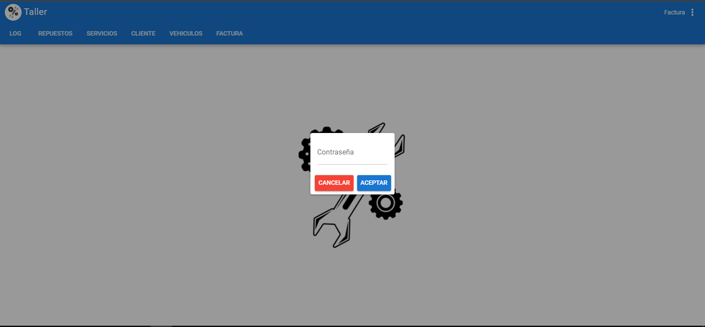
  Permite visualizar todos los endpoints consultados
- 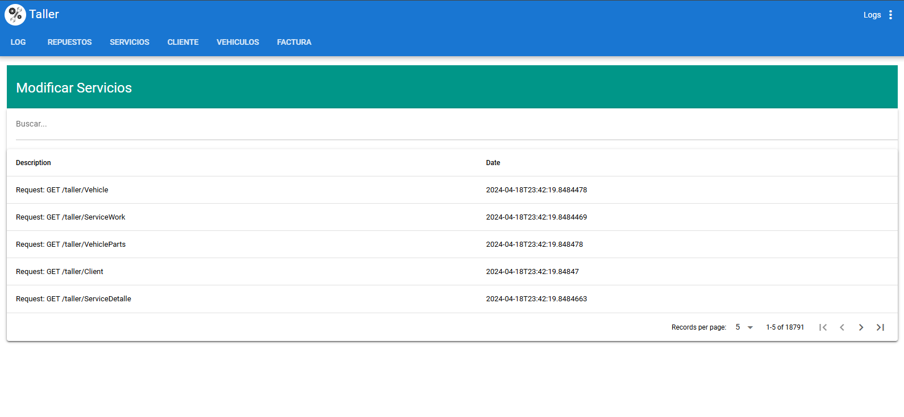

## Repuestos

ventana de Crear, buscar, modificar y eliminar repuestos

- 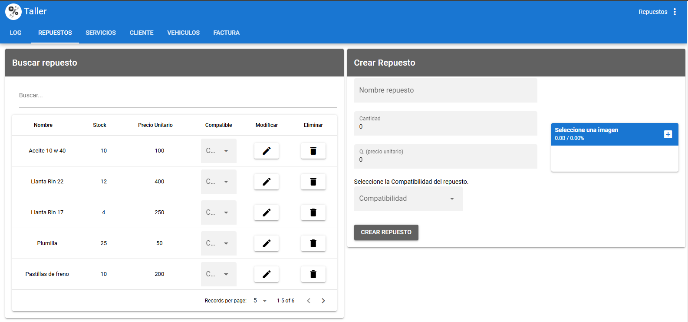
  Al seleccionar editar se cargan los datos del repuesto seleccionado en la ventana de **Editar repuesto**
- 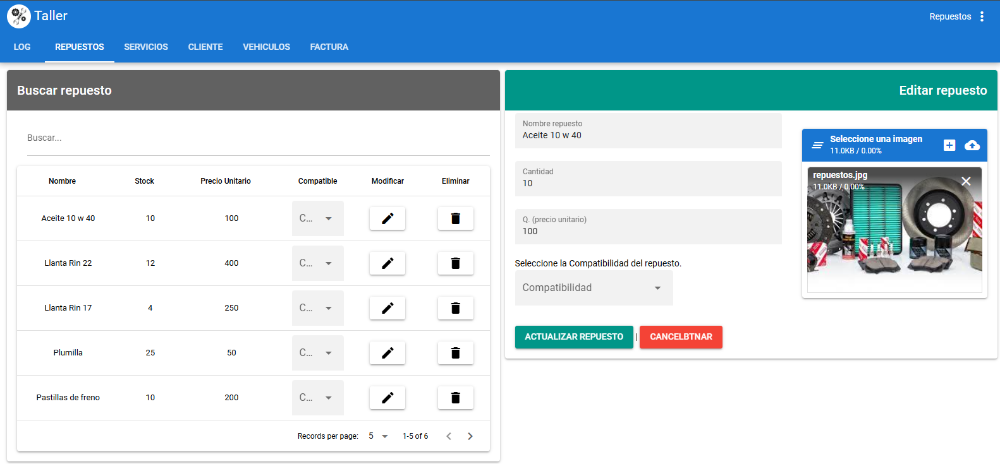

## Servicios

se permite seleccionar un vehiculo y este retorna toda la informacion del cliente, vehiculo y detalles asociados.

- 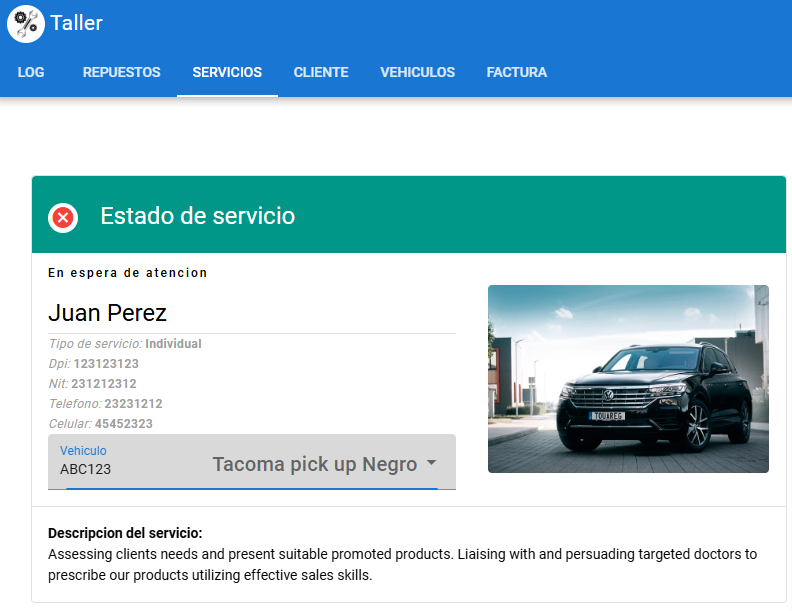
  Permite crear un nuevo servicio
- 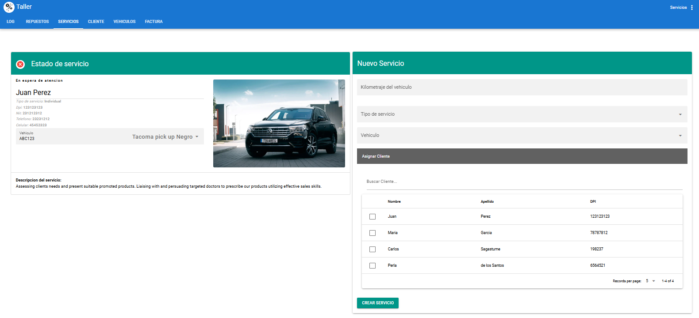

## Cliente

Se presenta Editar, modificar y eliminar, en la vista principal, permitiendo editar cada fila, solo seleccionando el dato que nos interesa, para luego seleccionar el boton de guardado, que actualiza los cambios realizados.

- 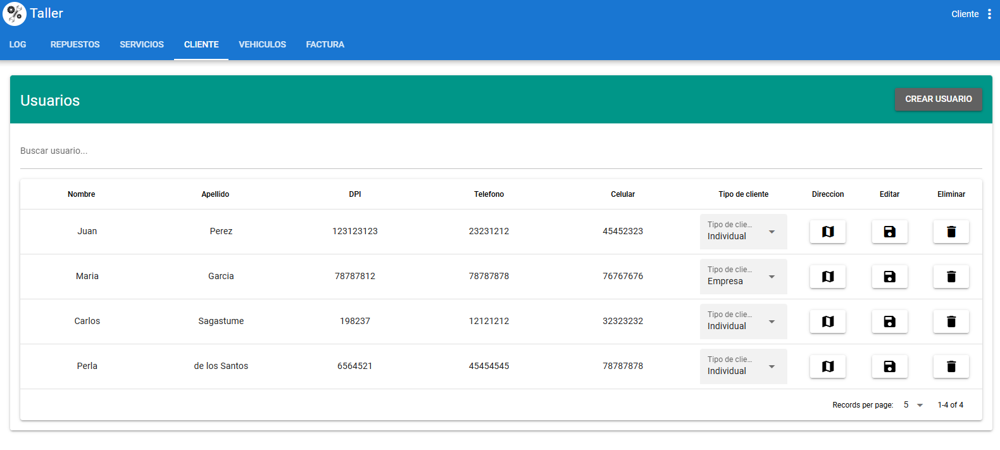
  Ventana que permite crear nuevos clientes, permitiendo seleccionar una direccion que proviene desde una carga masiva de datos (csv).
- 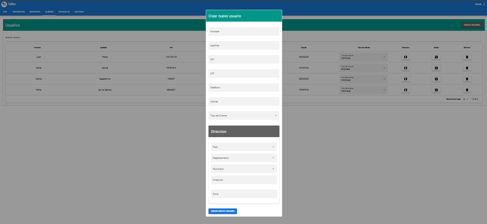

## Vehiculos

CRUD de vehiculos

- 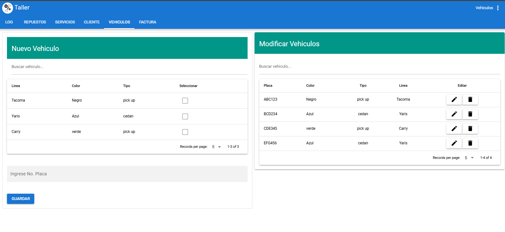

## Factura

Permite seleccionar y describir los gastos que realiza una persona, en la parete superior se puede encontrar la seleccion de usuario y vehiculo, con ello se asigna una factgura.

- 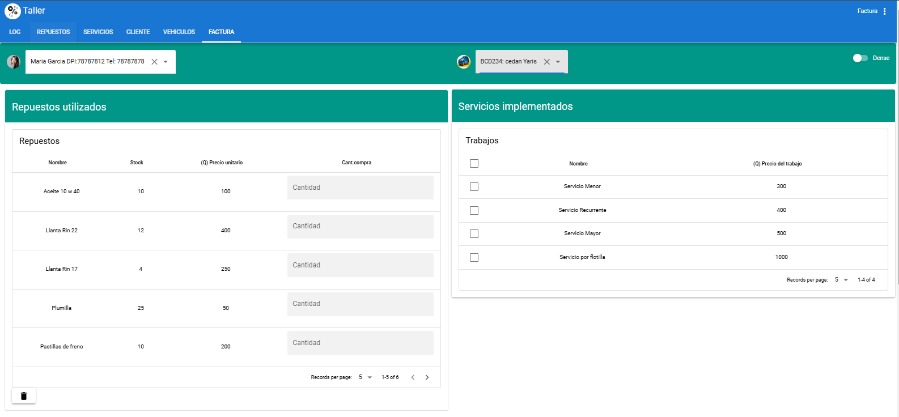

Fatura resultante , asignada al usuario seleccionado.

- 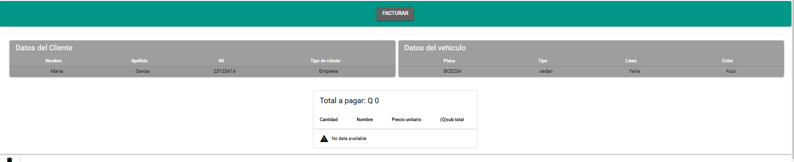
